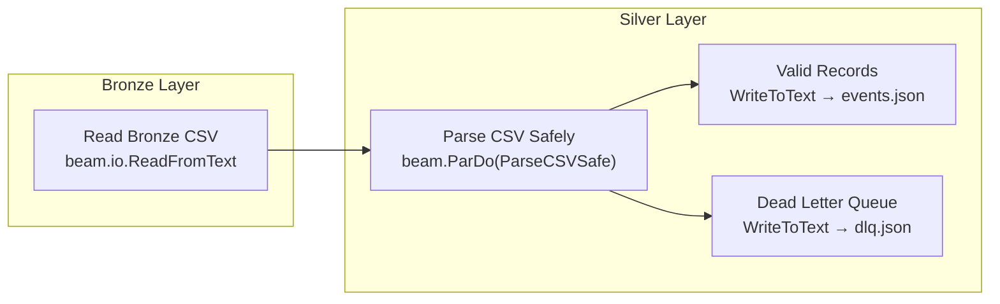

```mermaid
flowchart LR
    subgraph Bronze [Bronze Layer]
        A["Read Bronze CSV<br/>beam.io.ReadFromText"]
    end

    subgraph Silver [Silver Layer]
        B["Parse CSV Safely<br/>beam.ParDo(ParseCSVSafe)"]
        C["Valid Records<br/>WriteToText → events.json"]
        D["Dead Letter Queue<br/>WriteToText → dlq.json"]
    end

    A --> B
    B --> C
    B --> D
```